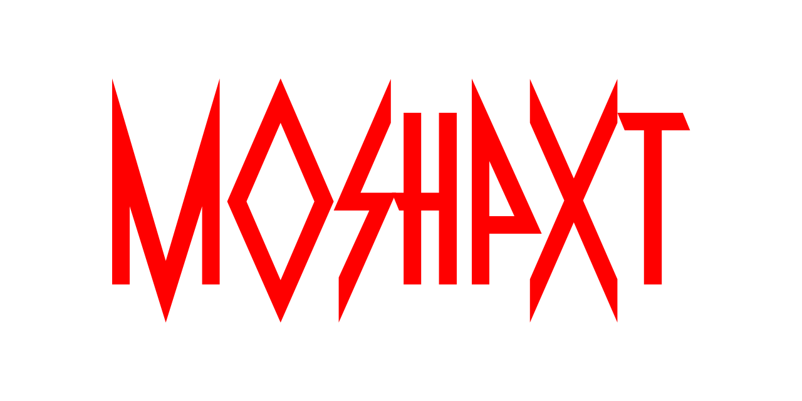

# Big Picture
**Areas of Study:** Bioinformatics, Natural Language Processing, Scalable Algorithms for Big Data \
**Graduation Date:** June 2023 \
**Contact:** rjeveloff (at) gmail (dot) com

<a href="resources/CV.pdf">CV</a> | <a href="resource/resume.pdf">Resume</a> | <a href="https://www.linkedin.com/in/rjeveloff/">LinkedIn</a>

# Projects

## MOSHPIT: Multiallelic Outbred-Strain Haplotype Phasing and Inference Tool

  

Currently in development, MOSHPIT aims to be the tool used for complex variant phasing and inference. This is my brainchild and the crux of my M.S. thesis, and was developed to fill the gap left by tools that exclusively phase SNPs (i.e. ShapeIt) and those which have prohibitive runtime consequences at scale (i.e. Beagle). Built on CλHMML (below), expect a streamlined experience with support for SNPs, STRs, Indels, and (soon) SVs! Expected release is March 2023.

Coming soon [here](https://github.com/gymrek-lab/MOSHPIT).

## CλHMML: Custom-Lambda Hidden Markov Model Library

  

Releasing in January 2023, CλHMML provides a Hidden Markov Model architecture built with long sequences and non-standard emission/transition probabilities in mind. Read more about it in its repository [here](https://github.com/gymrek-lab/CAHHML).

## Bioinformatics Algorithms: An Active Learning Approach

Edited and rewrote the backend for the majority of the premier bioinformatics textbook under the guidance of Dr. Pavel Pevzner. Unfortunately, I cannot post the backend code here, but [here](https://github.com/rjeveloff/BA_problemregister) is the associated problem register with test cases and problem statements written by myself and my colleague Parker Cote.
